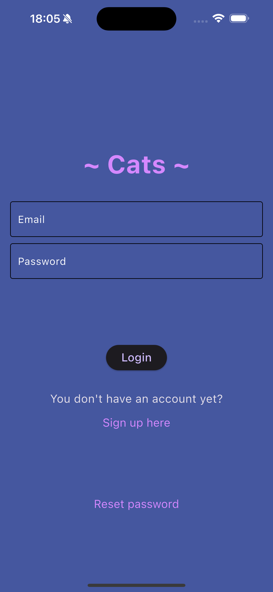
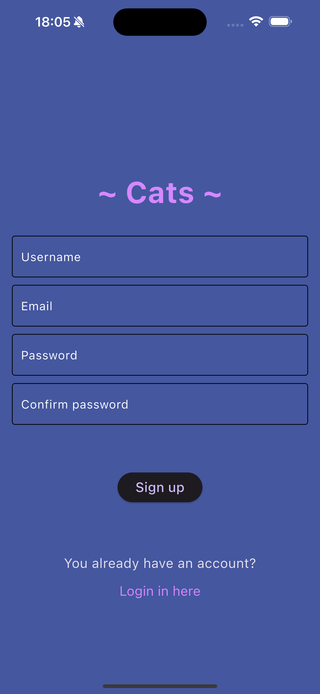
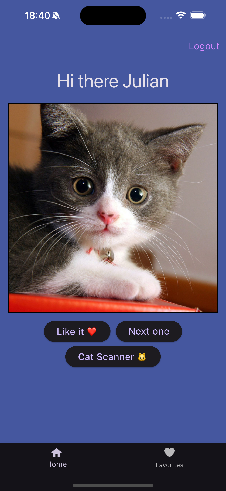
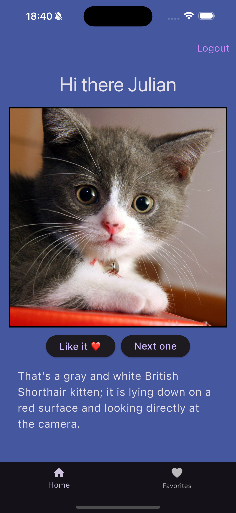
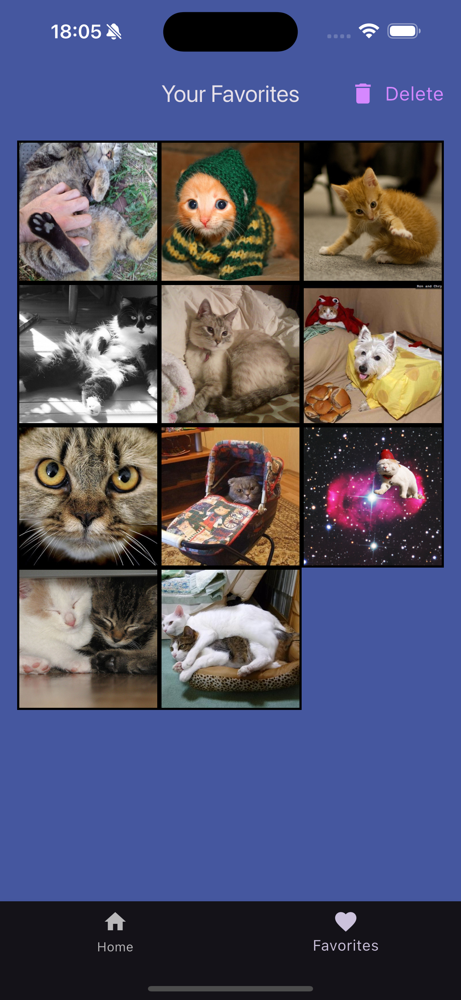
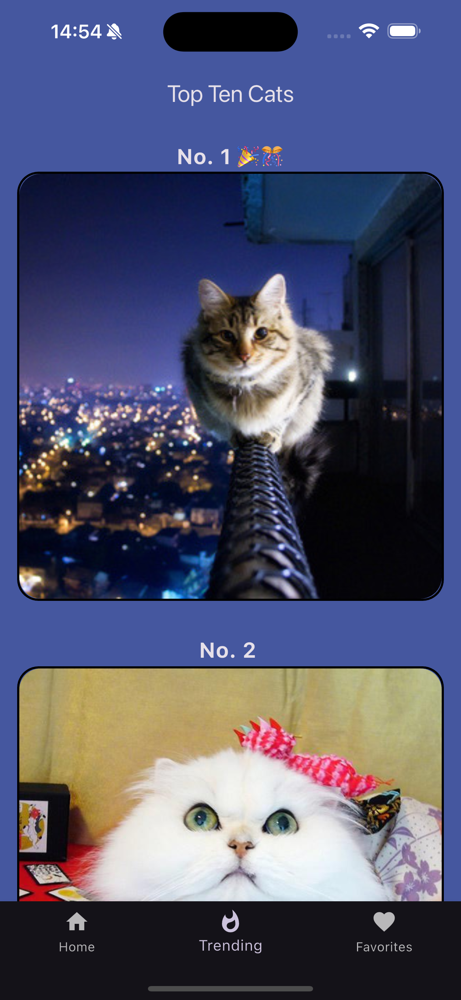

# 🐱 Cat App

A personal Flutter project to practice **clean architecture**, **Firebase integration**, and **state management**, wrapped in a fun cat-themed experience.

### 📸 Overview

This app fetches random cat images from [The Cat API](https://api.thecatapi.com/v1/images/search). Users can:

- View random cat images.
- Mark favorite images and save them to a personal gallery.
- Sign in via Firebase Authentication.
- Store favorites in Firestore tied to their user account.
- Tap a button to get a description of the current cat image, powered by **Google Gemini**.
- See the top ten most liked cat images

---

<table>
<tr>
<td></td>
<td></td>
</tr>
<tr>
<td></td>
<td></td>
</tr>
<tr>
<td></td>
<td></td>
</tr>
<tr>
<td></td>
</tr>
</table>

### 🧰 Technologies Used

- **Flutter 3.6+**
- **Firebase Authentication**
- **Cloud Firestore**
- **Provider** for state management
- **Google Gemini API** (via `google_generative_ai`)
- **The Cat API** for fetching images
- **Clean Architecture** and **Repository Pattern**
- `.env` configuration with `flutter_dotenv`
- `cached_network_image` for smooth image loading

---

### 🚀 Features

✅ Fetch random cat images  
✅ Save images to personal favorites  
✅ View favorites in a gallery  
✅ Firebase user authentication  
✅ "Cat Scanner" button – AI-powered image description  
✅ Fetches and shows top ten most liked images
✅ Clean separation of logic, services, UI, and data layers

---

### 💡 Potential Improvements

- Replace `Provider` with **Riverpod** for more scalable state management
- Implement animations/transitions for smoother UX

---

### 📁 Project Structure

<pre lang="md">
lib/
├── firebase_options.dart            # Firebase setup
├── main.dart                        # Entry point
└── src/
    ├── core/                        # Core theme and constants
    │   └── theme/
    ├── features/                    # Feature-first architecture
    │   ├── ai_integration/          # Google Gemini integration
    │   ├── auth/                    # Auth logic and UI
    │   ├── favorites/               # Favorite cats gallery
    │   ├── fetch_images/            # Image fetching and home screen
    |   └── top_ten_images/          # Show the ten most liked images 
    ├── main_app.dart                # Root of the app widget
    └── navigation_scaffold.dart    # App-wide navigation structure
</pre>


## 🔐 Environment Variables

You'll need a `.env` file in your project root with your API keys:

```env
API_KEY=your_google_gemini_api_key
```


